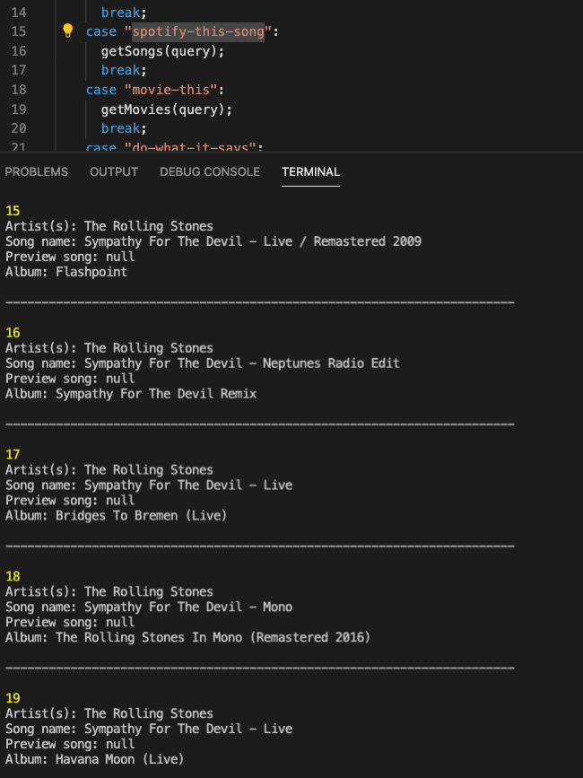
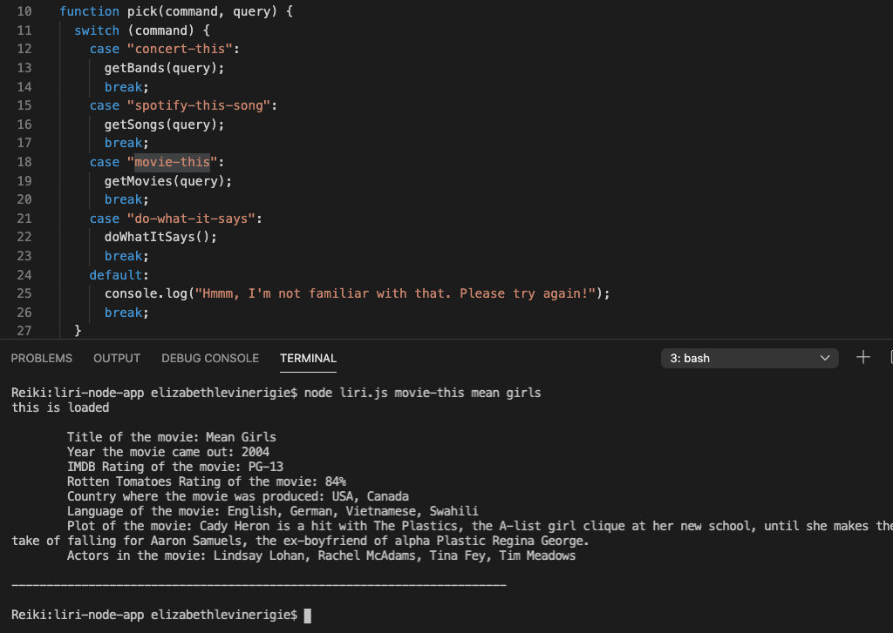
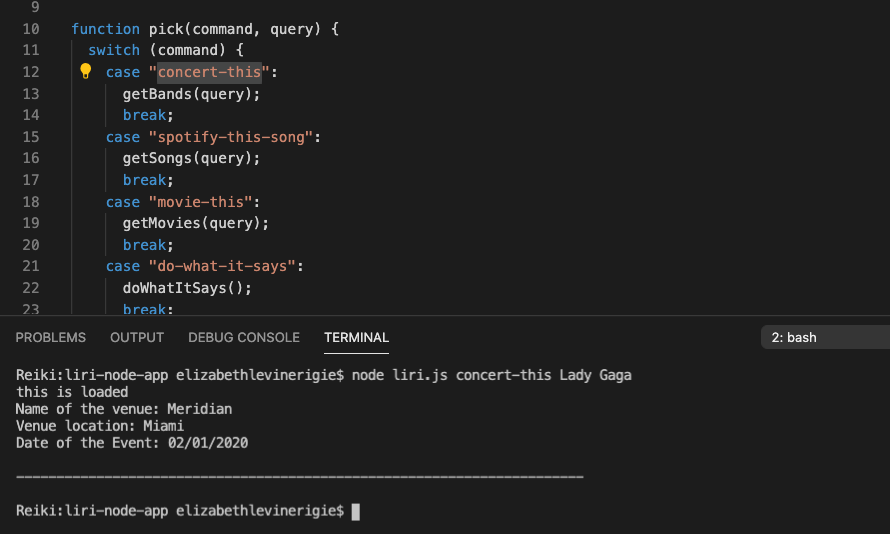
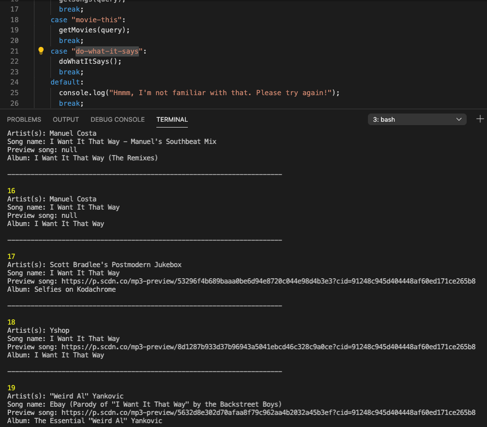

# liri-node-app

LIRI is a Language Interpretation and Recognition Interface — a command line node app that takes in parameters (Spotify for songs, Bands in Town for concerts, and OMDB for movies) and returns data.

### To begin the process of building LIRI, we first initialize NPM (in root directory then installed these packages:

 *  Node-Spotify-API
 *  Axios
 *  Moment 
 *  DotEnv

 ### The following API keys are required:

*  Spotify API
*  OMDB API
*  Bands In Town API

## Simple steps to search:
1. In the command line always type the following 2 arguments first (without quotes) "node" "liri.js"
2. Choose what you would like to search for (see list below). For example, should you wish to search     a song you would type node liri.js spotify-this-song song name, then press enter. (example;  node     liri.js spotify-this-song bohemian rhapsody, for a movie you would begin with the first two           arguments node liri.js movie-this wedding crashers )
3. If LIRI doesn't know what you're asking, it will let you know!
   

### Use these commands, followed by the movie, song or concert you'd like to search (no quotes necessary) and press enter:

*  spotify-this-song
*  movie-this
*  concert-this
*  do-what-it-says (this default demonstrates the program's ability to read from random.txt file)

## The following screenshots demonstrate the search results for each command

#### node liri.js spotify-this-song sympathy for the devil

#### node liri.js movie-this mean girls

#### node liri.js concert-this lady gaga

#### node liri.js do-what-it-says

## When spotify-this-song command is activated:
The node-spotify-api npm package will be triggered and will call the Spotify API with Axios returning the following information:

* Artist(s):
* The song’s name:
* A preview link of the song from Spotify:
* The album that the song is from: 

## When movie-this commmand is activated:
The OMDB API will be triggered and calls this API using Axios - LIRI returns the following:

* Title of the movie:
* Year the movie was released:
* IMDB Rating of the movie:
* Rotten Tomatoes Rating: 
* Country where the movie was produced:
* Language(s) of the movie:
* Plot summary:
* Actors in the movie:

## When concert-this is chosen: 
The Bands in Town Artist Events API will be triggered for the artist or band requested and LIRI will return:

* Name of the venue:
* Venue location:
* Date of the Event (powered by Moment NPM):